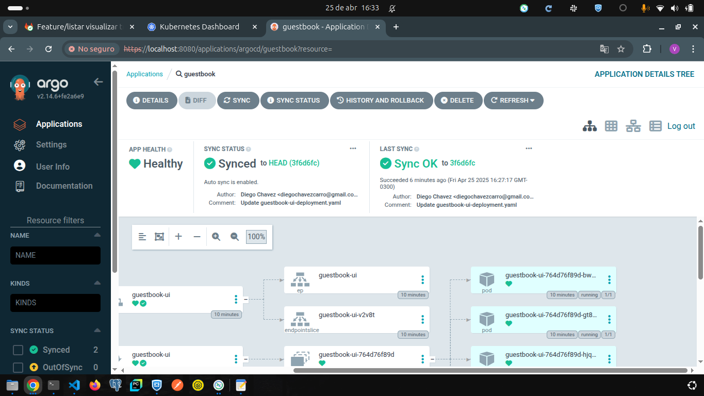

# argocd1

Bajarse el repo actual - ✅

git clone https://github.com/diegochavezcarro/argocd1.git

Entrar en el directorio argocd1 ✅

1. Instalar ArgoCD (https://argo-cd.readthedocs.io/en/stable/getting_started/):

kubectl create namespace argocd ✅

kubectl apply -n argocd -f https://raw.githubusercontent.com/argoproj/argo-cd/stable/manifests/install.yaml ✅

2. Hacer port forwarding para poder acceder al dashboard de ArgoCD:

kubectl port-forward svc/argocd-server -n argocd 8080:443 ✅

Se podra acceder por browser a localhost:8080, aceptar el certificado no valido. ✅

3. Obtener la password de ArgoCD:

kubectl -n argocd get secret argocd-initial-admin-secret -o jsonpath="{.data.password}" | base64 -d; echo ✅

Copiarla y hacer login con username admin y esa password. -> e0nmz7DIFC0eT4Ad  ✅

4. Desplegar una Application de ArgoCD:

kubectl apply -f guestbook-app.yaml ✅

Observar el dashboard de ArgoCD. ✅

5. Sincronizar en el dashboard. Observar como se despliega todo. ✅

6. Borrar en el dashboard el deployment. Sincronizar. Lo mismo por terminal y de vuelta Sincronizar
el dashboard. ✅

7. Agregar una replica mas en el deployment (en el repo de git!). Sincronizar y observar como se actualiza. ✅

8. Activar la sincronizacion con syncPolicy automated, agregando al guestbook-app.yaml la parte de 
syncPolicy, dentro del contexto spec, debajo de project por ejemplo:

  destination:
    server: 'https://kubernetes.default.svc'
    namespace: default
  project: default
  syncPolicy:
    automated:
      selfHeal: true
      prune: true
 
 El selfHeal hara que si borramos algo de forma manual en el cluster ese cambio se volvera
 atras, respetando como fuente de verdad al repositorio y el prune hara que incluso se borren
 recursos en el cluster cuando lo hagamos en el repo.
 No es necesario cambiar el codigo en el git, de hecho este archivo no es revisado por ArgoCD (solo
 especificamos el path guestbook), cambiar al archivo de forma local y desplegarlo:
 
kubectl apply -f guestbook-app.yaml

9. Como ejemplo borrar al deploy en el cluster y ver que sucede en instantes:

kubectl delete deploy guestbook-ui

10. Modificar en el repo para agregar una replica mas al deploy. Esperar unos 3 minutos y
observar el cambio, sin tener que sincronizar manualmente en el ArgoCD

